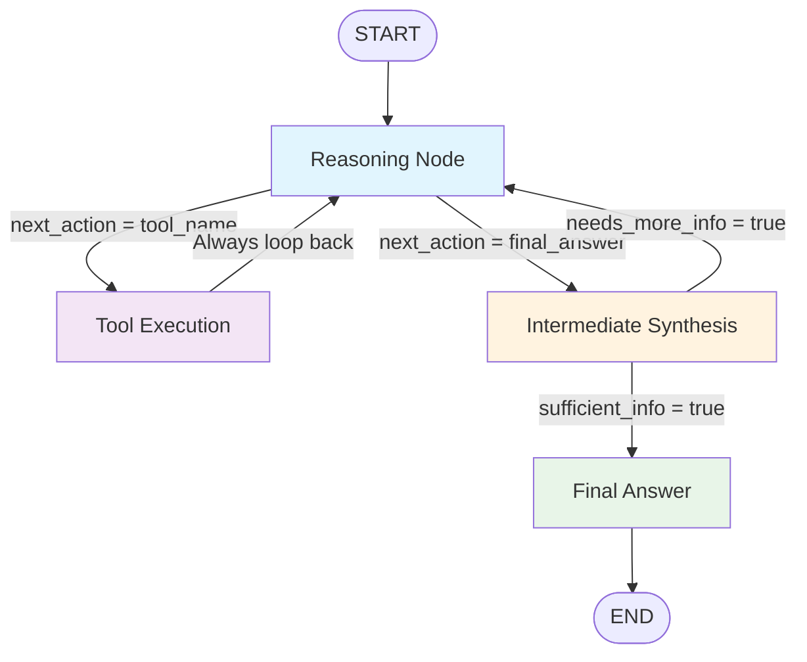

# 🔄 Corrected ReAct Loop Architecture

## ✅ **Fixed ReAct Loop Flow**



## 🔄 **Loop Components Explained**

### **Primary Loop**: `reasoning ↔ tool_execution`
- **Reasoning** decides what tool to use
- **Tool Execution** gathers information  
- **Always returns** to reasoning for next decision

### **Evaluation Point**: `intermediate_synthesis`
- **Triggered** when reasoning decides to evaluate progress
- **Assesses** if enough information has been gathered
- **Routes** back to reasoning OR to final answer

### **Exit Point**: `final_answer`
- **Only reached** when synthesis confirms sufficient information
- **Generates** comprehensive response
- **Ends** the ReAct process

## 🎯 **Why This Architecture is Correct**

### ❌ **Previous Issue (Linear)**:
```
reasoning → tool_execution → synthesis → END
```
*Problem: No loop back to gather more information*

### ✅ **Corrected ReAct Loop**:
```
reasoning ↔ tool_execution (primary loop)
     ↓
intermediate_synthesis (checkpoint)
     ↓
reasoning (continue) OR final_answer (end)
```
*Solution: Proper iterative reasoning with evaluation checkpoints*

## 📝 **Detailed Flow Example**

### User: *"What's the weather in Paris and how does it compare to New York?"*

**Step 1**: `reasoning`
- **Decision**: Need weather for Paris first
- **Action**: `web_search`
- **Route**: → `tool_execution`

**Step 2**: `tool_execution`
- **Execute**: Search "weather Paris today"
- **Result**: "Paris: 18°C, cloudy"
- **Route**: → `reasoning` (always)

**Step 3**: `reasoning`
- **Decision**: Now need New York weather
- **Action**: `web_search`  
- **Route**: → `tool_execution`

**Step 4**: `tool_execution`
- **Execute**: Search "weather New York today"
- **Result**: "New York: 22°C, sunny"
- **Route**: → `reasoning` (always)

**Step 5**: `reasoning`
- **Decision**: Have both cities, should evaluate
- **Action**: `final_answer`
- **Route**: → `intermediate_synthesis`

**Step 6**: `intermediate_synthesis`
- **Evaluation**: "I have weather for both Paris (18°C, cloudy) and New York (22°C, sunny). This is sufficient to compare."
- **Decision**: `final_answer`
- **Route**: → `final_answer`

**Step 7**: `final_answer`
- **Response**: "Currently, Paris is 18°C and cloudy while New York is 22°C and sunny. New York is 4 degrees warmer and has better weather conditions today."
- **Route**: → `END`

## 🔧 **Key Architectural Benefits**

### 1. **Proper Iterative Reasoning**
- Agent can gather multiple pieces of information
- Each tool execution informs the next reasoning step
- No premature termination of information gathering

### 2. **Smart Evaluation Checkpoints** 
- Intermediate synthesis prevents endless loops
- Evaluates completeness before final response
- Can identify missing information and continue reasoning

### 3. **Flexible Loop Control**
- Can execute 1 tool or 10 tools as needed
- Adapts to query complexity automatically
- Respects max iteration safety limits

### 4. **Natural Conversation Flow**
- Only provides final answer when ready
- Comprehensive responses based on all gathered information
- Maintains context across all reasoning steps

This corrected architecture now properly implements the ReAct pattern with iterative reasoning, tool usage, and evaluation! 🎉